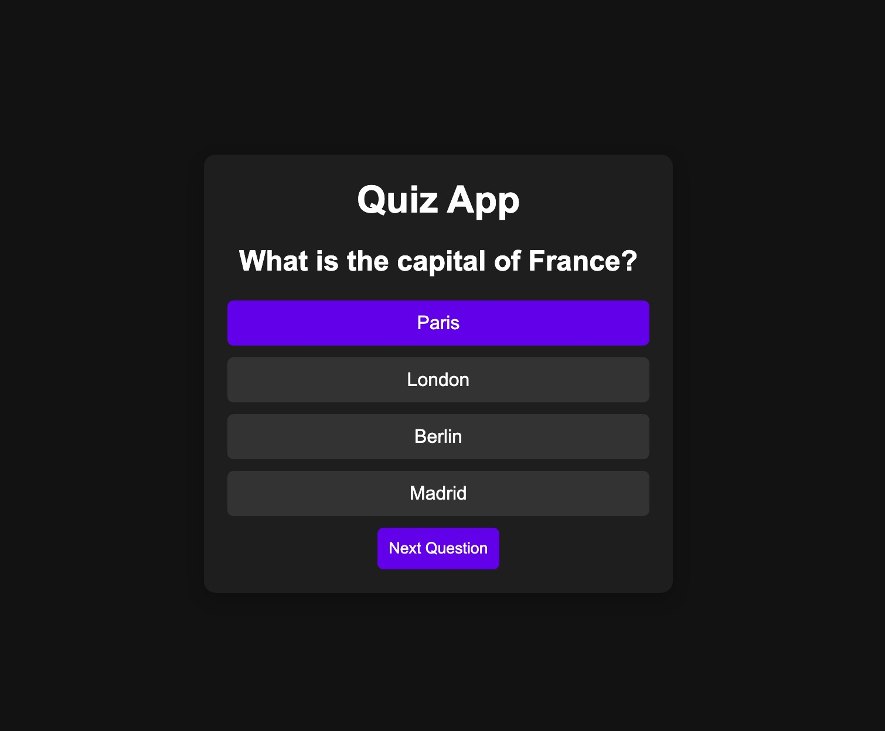
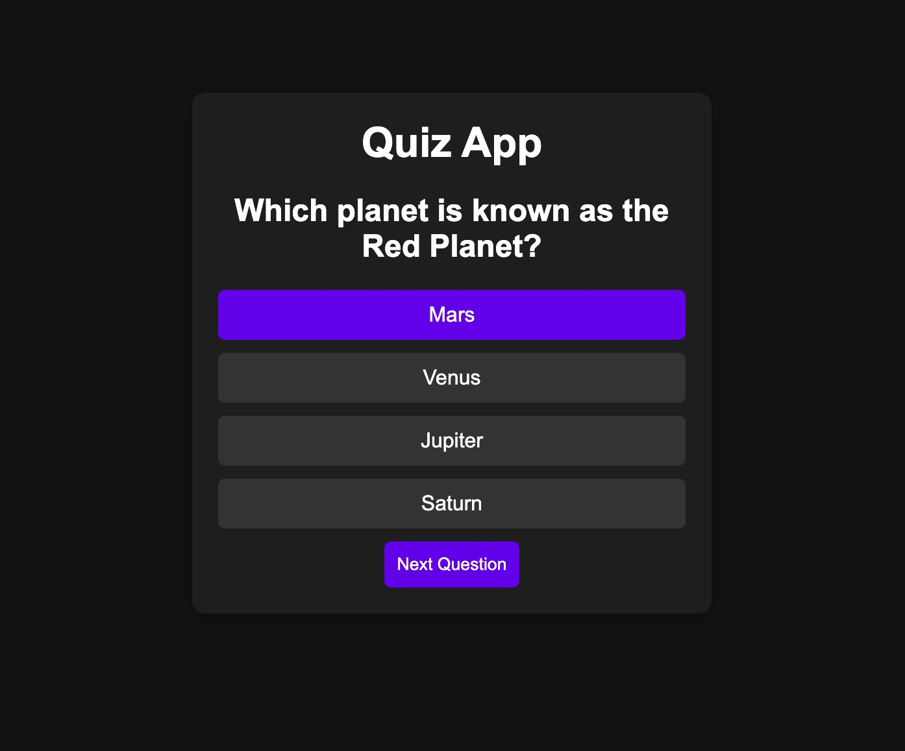
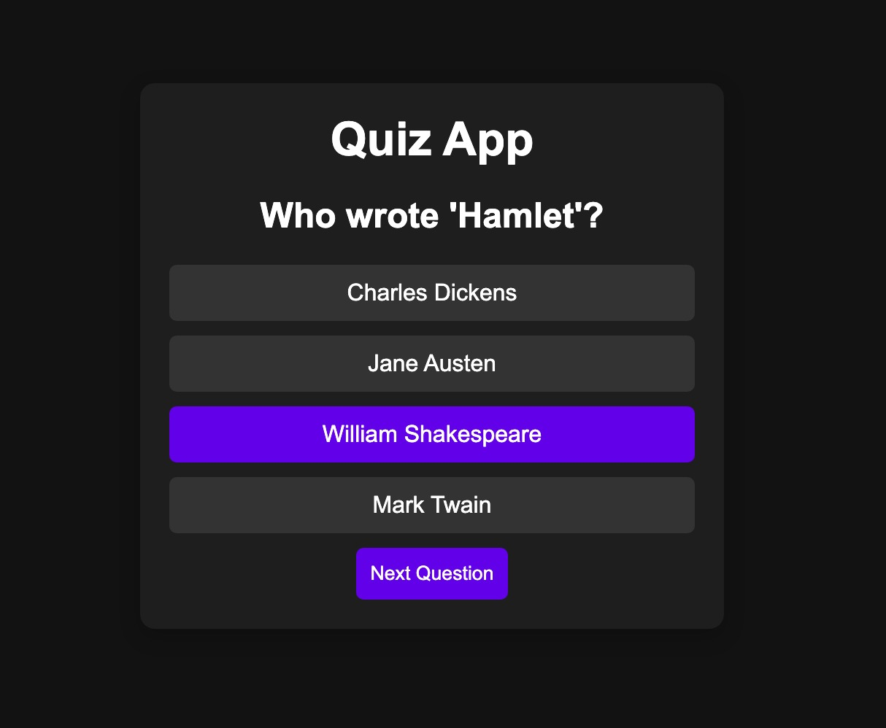

#  Quiz App

A simple and interactive quiz web application that lets users test their knowledge across various categories. The app presents multiple-choice questions, tracks the score. It’s designed to be responsive, user-friendly, and fun to use.

## Features

- Multiple Categories: Choose from a range of topics to test your knowledge.

- Multiple-Choice Questions: Each quiz session presents curated multiple-choice questions.

 

- Score Tracking: Keep track of your score as you progress through the quiz.

- Responsive Design: Seamlessly works on desktops, tablets, and mobile devices.

- Clean & User-Friendly UI: Enjoy a smooth, intuitive, and engaging user experience.

## Tech Stack

HTML, CSS, JavaScript

## Screenshots

## Author

- [@SunilKumarSharma129](https://www.github.com/SunilKumarSharma129
